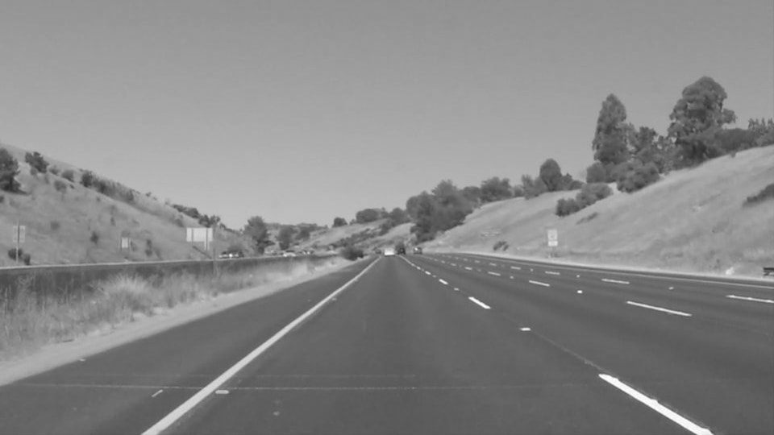
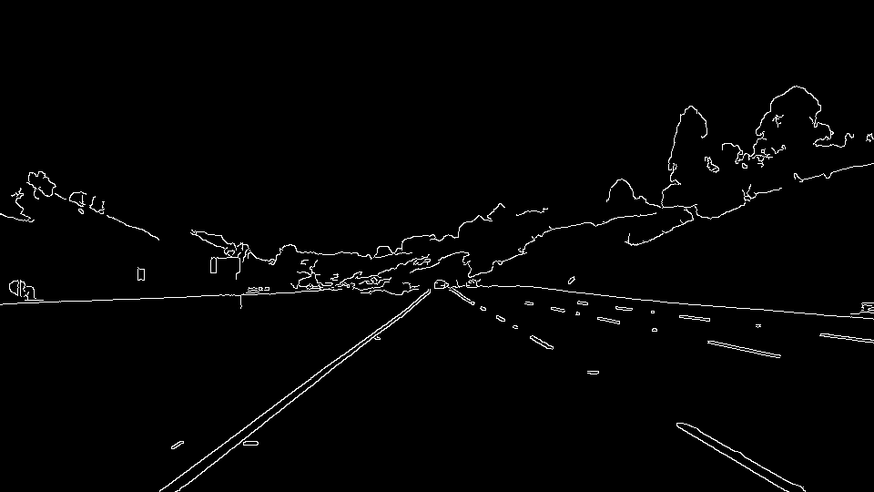
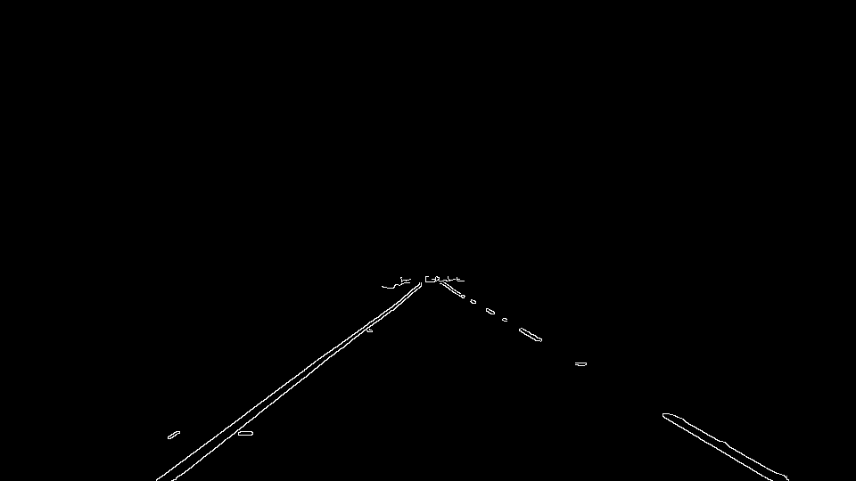
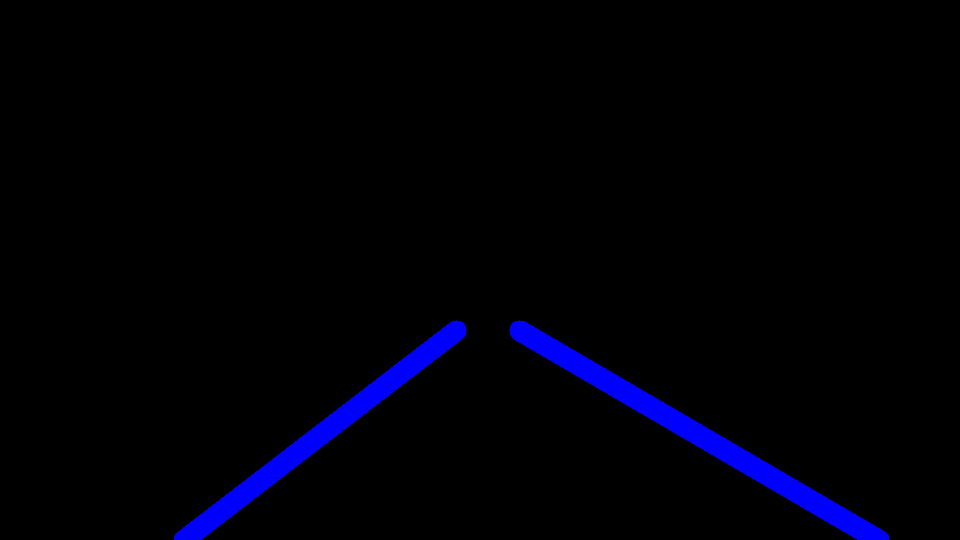
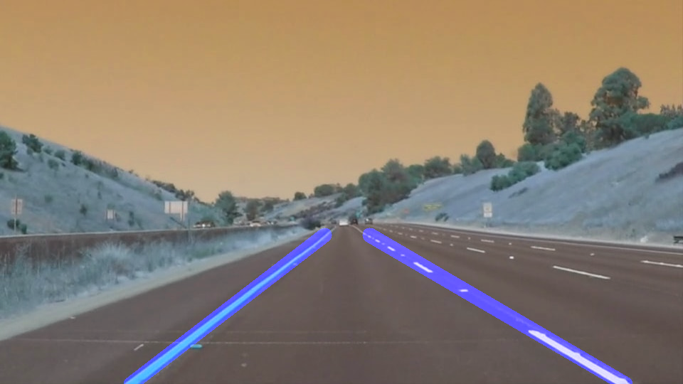

# **Finding Lane Lines on the Road** 
[](http://www.udacity.com/drive)


Overview
---

When we drive, we use our eyes to decide where to go.  The lines on the road that show us where the lanes are act as our constant reference for where to steer the vehicle.  Naturally, one of the first things we would like to do in developing a self-driving car is to automatically detect lane lines using an algorithm.

In this project you will detect lane lines in images using Python and OpenCV.  OpenCV means "Open-Source Computer Vision", which is a package that has many useful tools for analyzing images.  

To complete the project, two files will be submitted: a file containing project code and a file containing a brief write up explaining your solution. We have included template files to be used both for the [code](https://github.com/udacity/CarND-LaneLines-P1/blob/master/P1.ipynb) and the [writeup](https://github.com/udacity/CarND-LaneLines-P1/blob/master/writeup_template.md).The code file is called P1.ipynb and the writeup template is writeup_template.md 

To meet specifications in the project, take a look at the requirements in the [project rubric](https://review.udacity.com/#!/rubrics/322/view)


Creating a Great Writeup
---
For this project, a great writeup should provide a detailed response to the "Reflection" section of the [project rubric](https://review.udacity.com/#!/rubrics/322/view). There are three parts to the reflection:

1. Describe the pipeline

2. Identify any shortcomings

3. Suggest possible improvements

We encourage using images in your writeup to demonstrate how your pipeline works.  

All that said, please be concise!  We're not looking for you to write a book here: just a brief description.

You're not required to use markdown for your writeup.  If you use another method please just submit a pdf of your writeup. Here is a link to a [writeup template file](https://github.com/udacity/CarND-LaneLines-P1/blob/master/writeup_template.md). 


The Project
---

## If you have already installed the [CarND Term1 Starter Kit](https://github.com/udacity/CarND-Term1-Starter-Kit/blob/master/README.md) you should be good to go!   If not, you should install the starter kit to get started on this project. ##

**Step 1:** Set up the [CarND Term1 Starter Kit](https://github.com/udacity/CarND-Term1-Starter-Kit/blob/master/README.md) if you haven't already.

**Step 2:** Open the code in a Jupyter Notebook

You will complete the project code in a Jupyter notebook.  If you are unfamiliar with Jupyter Notebooks, check out [Udacity's free course on Anaconda and Jupyter Notebooks](https://classroom.udacity.com/courses/ud1111) to get started.

Jupyter is an Ipython notebook where you can run blocks of code and see results interactively.  All the code for this project is contained in a Jupyter notebook. To start Jupyter in your browser, use terminal to navigate to your project directory and then run the following command at the terminal prompt (be sure you've activated your Python 3 carnd-term1 environment as described in the [CarND Term1 Starter Kit](https://github.com/udacity/CarND-Term1-Starter-Kit/blob/master/README.md) installation instructions!):

`> jupyter notebook`

A browser window will appear showing the contents of the current directory.  Click on the file called "P1.ipynb".  Another browser window will appear displaying the notebook.  Follow the instructions in the notebook to complete the project.  

**Step 3:** Complete the project and submit both the Ipython notebook and the project writeup

## How to write a README
A well written README file can enhance your project and portfolio.  Develop your abilities to create professional README files by completing [this free course](https://www.udacity.com/course/writing-readmes--ud777).


# **Writeup for submission** 

---


**Finding Lane Lines on the Road**

The goals / steps of this project are the following:
* Make a pipeline that finds lane lines on the road
* Reflect on your work in a written report

Environment used : Docker

Installation guide : [CarND-Term1-Starter-Kit](https://github.com/udacity/CarND-Term1-Starter-Kit/blob/master/doc/configure_via_docker.md)
After installing Docker, clone this repo and in the repo directory run : 

```docker run -it --rm --entrypoint "/run.sh" -p 8888:8888 -v `pwd`:/src udacity/carnd-term1-starter-kit```

Then run `jupyer notebook` with another terminal to launch Jupyter Notebook

---

### Reflection

### 1. Pipeline for finding lines in a image.

First choose image `whiteCarLaneSwitch.jpg` from test images.

```image = mpimg.imread('test_images/whiteCarLaneSwitch.jpg')```

<p align="center">
  
</p>

1. Turn the image into gray scale:

```gray_image = grayscale(image)```

<p align="center">
  
</p>

2. Detect edges with canny() function:

```edge_image = canny(gray_image, low_threshold, high_threshold)```

<p align="center">
  
</p>

3. Apply mask to filter out unnecessary lines:

```
height = image.shape[0]
width = image.shape[1]
height_offset = 40
width_offset = 30
vertices = np.array([[0, height], 
                     [width, height], 
                     [width*1/2 + width_offset, height*1/2 + height_offset], 
                     [width*1/2 - width_offset, height*1/2 + height_offset]], 
                     np.int32)
masked_image = region_of_interest(edge_image, vertices)
```

<p align="center">
  
</p>

4. Use HoughLinesP() and draw_lines() to cluster lines :

```
rho = 1
theta = np.pi/180
threshold = 32
min_line_length = 10
max_line_gap = 200
line_img = hough_lines(masked_image, rho, theta, threshold, min_line_length, max_line_gap)
```

<p align="center">
  
</p>

in the `draw_lines()`, firstly check the slope of each line, then add lines into arrays for left and right:
```
current_slope = (y2-y1)/(x2-x1)
intercept = y1 -current_slope*x1

if current_slope < 0.0 and current_slope > -math.inf:
    negative_slopes.append(current_slope) # left line
    left_line_x.append(x1)
    left_line_x.append(x2)
    left_line_y.append(y1)
    left_line_y.append(y2)
    negetive_intercepts.append(intercept)

elif current_slope > 0.0 and current_slope < math.inf:
    positive_slopes.append(current_slope) # right line
    right_line_x.append(x1)
    right_line_x.append(x2)
    right_line_y.append(y1)
    right_line_y.append(y2)
    positive_intercepts.append(intercept)
```

Then average the lines on each side, then calculate a single line for each side and draw them:
```
if len(positive_slopes) > 0 and len(right_line_x) > 0 and len(right_line_y) > 0:
    avg_positive_slope = sum(positive_slopes) / len(positive_slopes)
    avg_right_line_x = sum(right_line_x) / len(right_line_x)
    avg_right_line_y = sum(right_line_y ) / len(right_line_y)
    avg_intercept = sum(positive_intercepts) / len(positive_intercepts)    
    x_min=int((y_min-avg_intercept)/avg_positive_slope) 
    x_max = int((y_max - avg_intercept)/ avg_positive_slope)
    cv2.line(img, (x_min, y_min), (x_max, y_max), color, 20)

if len(negative_slopes) > 0 and len(left_line_x) > 0 and len(left_line_y) > 0:
    avg_negative_slope = sum(negative_slopes) / len(negative_slopes)
    avg_left_line_x = sum(left_line_x) / len(left_line_x)
    avg_left_line_y = sum(left_line_y ) / len(left_line_y)
    avg_intercept = sum(negetive_intercepts) / len(negetive_intercepts)
    x_min = int((y_min-avg_intercept)/avg_negative_slope) 
    x_max = int((y_max - avg_intercept)/ avg_negative_slope)
    cv2.line(img, (x_min, y_min), (x_max, y_max), color, 20)
```

5. Lastly combine the lines with the original image :

```
weighted_image = weighted_img(image,line_img , α=0.9, β=0.9, γ=0.)
```

<p align="center">
  
</p>

### 2. Apple the pipeline on video.

Put the pipeline into `process_image()` : 

```
def process_image(image):
    gray_image = grayscale(image)
    
    low_threshold = 85
    high_threshold = 3 * low_threshold
    edge_image = canny(gray_image, low_threshold, high_threshold)
    
    height = image.shape[0]
    width = image.shape[1]
    height_offset = 40
    width_offset = 30
    vertices = np.array([[0, height], 
                     [width, height], 
                     [width*1/2 + width_offset, height*1/2 + height_offset], 
                     [width*1/2 - width_offset, height*1/2 + height_offset]], 
                     np.int32)
    masked_image = region_of_interest(edge_image, vertices)
    
    rho = 1
    theta = np.pi/180
    threshold = 32
    min_line_length = 10
    max_line_gap = 200
    line_img = hough_lines(masked_image, rho, theta, threshold, min_line_length, max_line_gap)
    
    result = weighted_img(image,line_img , α=0.9, β=0.9, γ=0.)

    return result
```

### Video results

**solidWhiteRight.mp4 :**

<p align="left">
  
</p>


**solidYellowLeft.mp4 :**

<p align="left">
  
</p>


### 3. Suggest possible improvements to your pipeline

More tuning might be needed since the curves of lines vary depending on different scenes.

